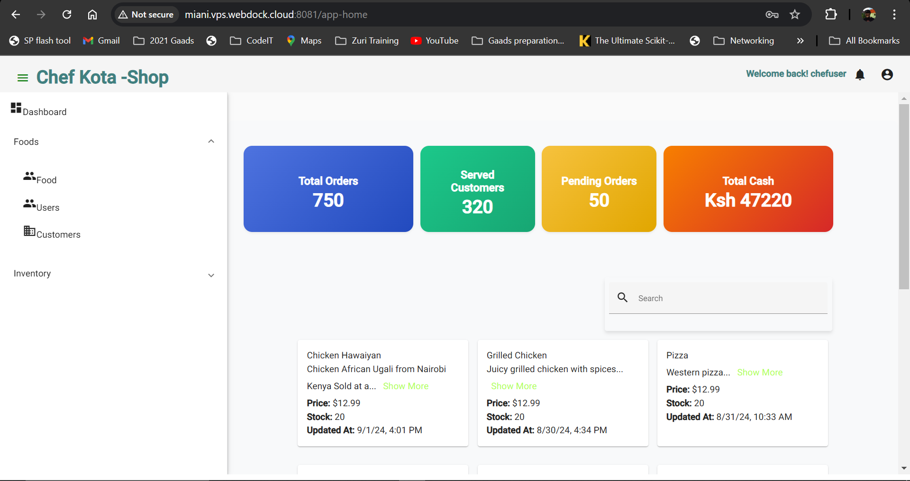
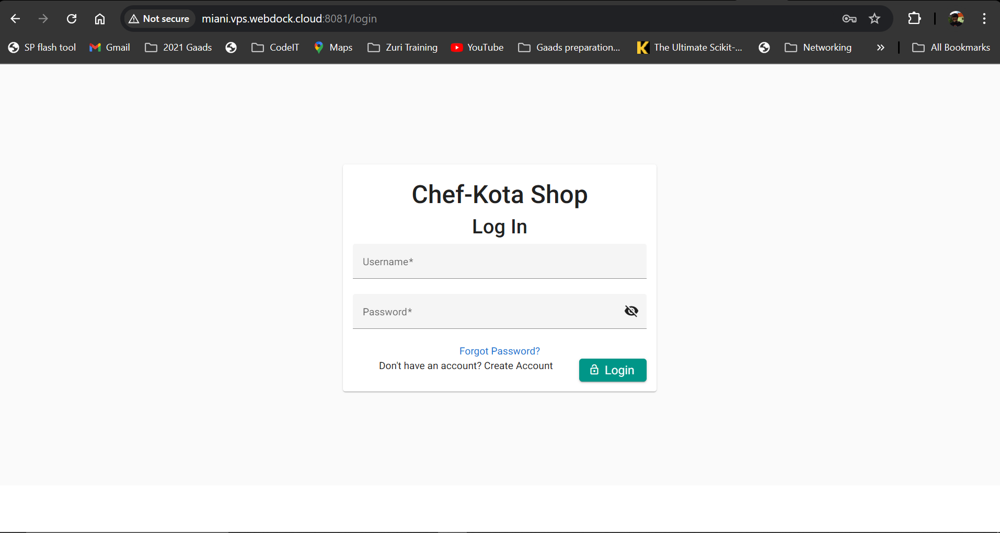
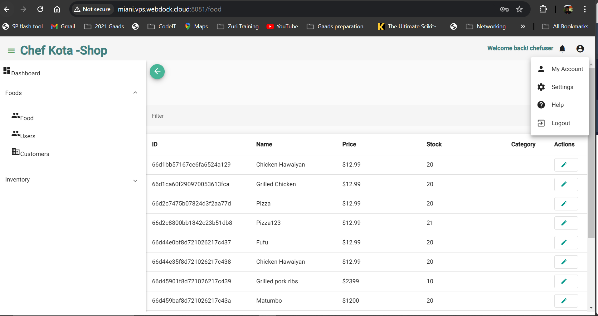
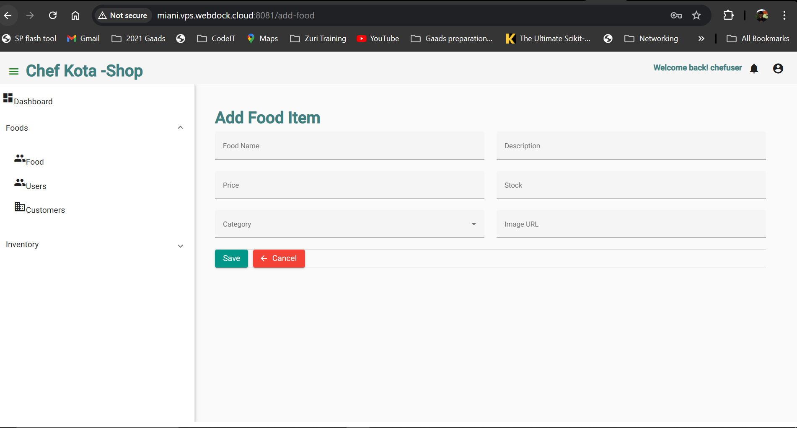
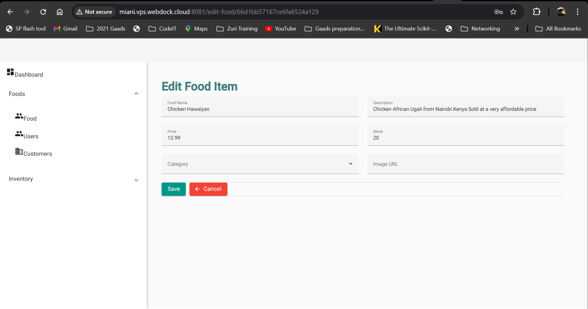

# Chef-Kota-Manager

Chef-Kota-Manager is a full-stack application tailored for chefs managing a Kota shop. The application allows chefs to manage food items, including adding, updating, and deleting items. It features user authentication with JWT tokens, a dashboard displaying current inventory levels, and a user-friendly interface. The application is built with Go (Golang) for the backend and a JavaScript framework for the frontend, and it is fully Dockerized for easy deployment.

## Features

- **User Authentication**: Secure registration and login using JWT (JSON Web Tokens).
- **Food Item Management**: Add, update, and delete food items.
- **Inventory Dashboard**: View the current inventory levels of all food items.
- **Full-Stack Solution**: Backend developed in Go (Golang) and frontend using a modern JavaScript framework.
- **Dockerized Application**: Easily deployable using Docker Compose.

## Technology Stack

- **Backend**: Go (Golang)
- **Frontend**: JavaScript framework used (Angular)
- **Database**: Database used (MongoDB)
- **Authentication**: JWT (JSON Web Tokens)
- **Deployment**: Docker & Docker Compose

## Getting Started

### Prerequisites

- [Docker](https://www.docker.com/get-started)
- [Docker Compose](https://docs.docker.com/compose/install/)
- [Git](https://git-scm.com/)

### Installation

1. **Clone the repository**:
   ```bash
   git clone https://github.com/JosephKithome/chef-kota-shop.git
   cd chef-kota-shop

## Application Screenshots

Here are some screenshots of the application:

### Dashboard


### Login Page


### Food Item Management


### Add Food Item Management


### Edit Food Item Management



   
